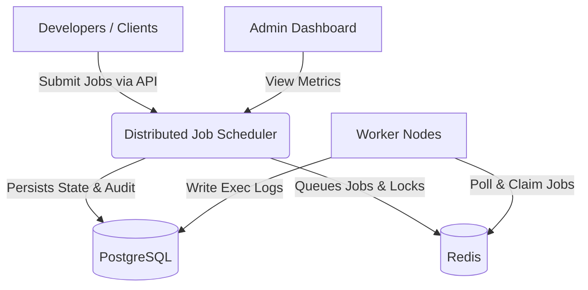
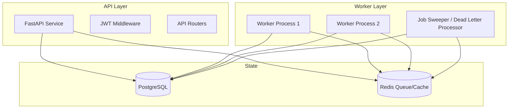

# Sprint 1: High-Level Architecture

## 1. Objectives
- Establish the macro architecture of the Distributed Job Scheduler.
- Define Context, Component, Deployment, and Data Flow diagrams in textual/mermaid format.
- Outline architecture trade-offs and performance justifications.

## 2. Design Decisions & Architecture Diagrams

### Context Diagram
The system acts as a centralized broker for executing asynchronous, scheduled, or batch tasks on behalf of external developers and applications.


### Component Diagram


### Deployment Diagram
The system is designed for containerized deployment, ideally on Kubernetes.
- **Ingress Controller** routes traffic to the API service.
- **API Pods** (ReplicaSet): Scales horizontally based on HTTP request load.
- **Worker Pods** (ReplicaSet): Scales horizontally based on Queue Depth (e.g., using KEDA).
- **Redis**: High availability cluster or managed service (e.g., AWS ElastiCache) for O(1) job queue operations.
- **PostgreSQL**: Managed relation DB (e.g., AWS Aurora) with read replicas if reporting becomes heavy.

## 3. Industry Best Practices
- **Eventual Consistency**: While Redis holds the strict lock and immediate state of a job, PostgreSQL acts as the source of truth for historical and auditing purposes. They sync eventually.
- **Stateless API**: The API layer stores no state in-memory, making it trivially scalable.
- **Push vs. Pull (Polling)**: Workers will pull jobs using `BRPOP` (blocking pop) on Redis lists to minimize CPU overhead while ensuring instant job delivery when queues are empty. For Delayed jobs, a sweeper pushes them to the Ready list.
- **Lock-free Claiming**: Using Lua scripts in Redis ensures that check-and-set operations (e.g., claiming a job and setting its state to PROCESSING) happen atomically.

## 4. Folder Structure (Current State)
```text
.
└── docs/
    ├── Sprint_0_Requirements_Analysis.md
    └── Sprint_1_High_Level_Architecture.md
```

## 5. Complete Code
*Sprint 1 focuses on architecture planning. Code scaffolding begins in Sprint 3.*

## 6. Detailed Explanation & Trade-offs
- **Trade-off (Redis vs. Kafka/RabbitMQ)**: We chose Redis over a traditional message broker like RabbitMQ. While RabbitMQ provides better native dead-letter and routing features, Redis provides absolute control over data structures (like Sorted Sets for scheduled/delayed jobs) which are notoriously difficult to implement well in pure messaging queues.
- **Time Complexity of Claiming**: O(1) for immediate queues (`LPOP`), O(log(N)) for priority/scheduled queues (`ZPOPMIN`).
- **Failure Scenarios**:
  - **Worker Crash during Processing**: The job remains in the "Processing" set. A Sweeper process runs periodically, identifies jobs whose timeout has expired, and moves them back to the "Ready" queue or DLQ.
  - **Redis Failure**: If Redis crashes, in-flight job state might be lost if persistence is not tuned. Aof (Append Only File) should be enabled with fsync=everysec.

## 7. API Documentation (Impacted)
The API will strictly enforce rate limiting (via Redis) to prevent clients from overwhelming the PostgreSQL database with job creation requests.

## 8. Database Changes
No schema defined yet. The ER model will be finalized in Sprint 2.

## 9. Testing Strategy
- **Architecture Validation**: Load test the Redis queueing mechanism using locust.io (Sprint 9) to verify that lock-free atomic claiming scales linearly with the number of workers without introducing latency.

## 10. Next Sprint Plan
**Sprint 2: Database Design**
- SQL Normalization (Organizations, Projects, Queues, Jobs).
- Defining Indexes for high-throughput querying (e.g., filtering jobs by status and queue).
- ER Diagram creation.
