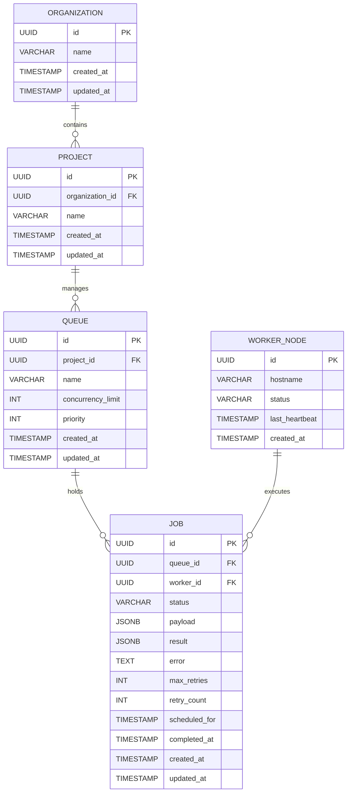

# Sprint 2: Database Design

## 1. Objectives
- Design a scalable PostgreSQL schema that acts as the persistent source-of-truth for the Distributed Job Scheduler.
- Ensure strict logical separation via multi-tenancy (Organizations & Projects).
- Define primary keys, foreign keys, constraints, and JSONB payload handling.
- Produce an ER diagram visualizing the relationships.

## 2. Design Decisions & Schema Definition
We are prioritizing consistency and auditability for the relational database. High-frequency state changes (like "queued" -> "claimed") will happen in Redis, while terminal states ("completed", "failed") and configuration states (creating queues/projects) will be persisted in PostgreSQL.

### Entity-Relationship (ER) Diagram


## 3. Industry Best Practices
- **UUIDs for Primary Keys**: We use UUIDv4 for all primary keys to prevent ID guessing and to allow distributed workers to generate Job IDs safely before inserting them into the database.
- **JSONB for Unstructured Data**: The `payload` and `result` columns use PostgreSQL's `JSONB`. This prevents schema migrations every time a user wants to submit a different type of job payload.
- **Foreign Key Constraints with Cascading**: Deleting an Organization will cascade down to Projects -> Queues -> Jobs, ensuring no orphaned data.
- **Optimized Indexing**: We create a composite index on `(queue_id, status)` because the most common administrative query will be "show me all failed jobs in queue X."

## 4. Folder Structure (Upcoming for Sprint 3)
```text
backend/
└── app/
    └── db/
        ├── models.py       # SQLAlchemy representations of this schema
        └── migrations/     # Alembic revision history
```

## 5. Complete Code (SQL Representation)
*Note: In Sprint 3, this will be implemented via SQLAlchemy and Alembic. This is the raw SQL representation of our design.*

```sql
CREATE EXTENSION IF NOT EXISTS "uuid-ossp";

CREATE TABLE organizations (
    id UUID PRIMARY KEY DEFAULT uuid_generate_v4(),
    name VARCHAR(255) NOT NULL,
    created_at TIMESTAMP WITH TIME ZONE DEFAULT NOW(),
    updated_at TIMESTAMP WITH TIME ZONE DEFAULT NOW()
);

CREATE TABLE projects (
    id UUID PRIMARY KEY DEFAULT uuid_generate_v4(),
    organization_id UUID NOT NULL REFERENCES organizations(id) ON DELETE CASCADE,
    name VARCHAR(255) NOT NULL,
    created_at TIMESTAMP WITH TIME ZONE DEFAULT NOW(),
    updated_at TIMESTAMP WITH TIME ZONE DEFAULT NOW()
);

CREATE TABLE queues (
    id UUID PRIMARY KEY DEFAULT uuid_generate_v4(),
    project_id UUID NOT NULL REFERENCES projects(id) ON DELETE CASCADE,
    name VARCHAR(255) NOT NULL,
    concurrency_limit INTEGER,
    priority INTEGER DEFAULT 1,
    created_at TIMESTAMP WITH TIME ZONE DEFAULT NOW(),
    updated_at TIMESTAMP WITH TIME ZONE DEFAULT NOW(),
    UNIQUE(project_id, name)
);

CREATE TABLE worker_nodes (
    id UUID PRIMARY KEY DEFAULT uuid_generate_v4(),
    hostname VARCHAR(255) NOT NULL,
    status VARCHAR(50) DEFAULT 'active',
    last_heartbeat TIMESTAMP WITH TIME ZONE DEFAULT NOW(),
    created_at TIMESTAMP WITH TIME ZONE DEFAULT NOW()
);

CREATE TABLE jobs (
    id UUID PRIMARY KEY DEFAULT uuid_generate_v4(),
    queue_id UUID NOT NULL REFERENCES queues(id) ON DELETE CASCADE,
    worker_id UUID REFERENCES worker_nodes(id) ON DELETE SET NULL,
    status VARCHAR(50) NOT NULL DEFAULT 'queued',
    payload JSONB NOT NULL DEFAULT '{}'::jsonb,
    result JSONB,
    error TEXT,
    max_retries INTEGER DEFAULT 3,
    retry_count INTEGER DEFAULT 0,
    scheduled_for TIMESTAMP WITH TIME ZONE,
    completed_at TIMESTAMP WITH TIME ZONE,
    created_at TIMESTAMP WITH TIME ZONE DEFAULT NOW(),
    updated_at TIMESTAMP WITH TIME ZONE DEFAULT NOW()
);

-- Critical Indexes for Performance
CREATE INDEX idx_jobs_queue_id_status ON jobs(queue_id, status);
CREATE INDEX idx_jobs_scheduled_for ON jobs(scheduled_for);
CREATE INDEX idx_workers_heartbeat ON worker_nodes(last_heartbeat);
```

## 6. Detailed Explanation
The schema isolates workloads. A user belongs to an Organization, which owns Projects. Queues belong to Projects. This makes it trivial to query billing/usage metrics per Organization. 

When a worker pulls a job from Redis, it will eventually update the `worker_id` and `status` in the PostgreSQL `jobs` table to establish an audit trail. If the worker crashes, the `last_heartbeat` on the `worker_nodes` table will grow stale. The Sweeper service can look for stale workers, find their associated `processing` jobs, and re-queue them.

## 7. API Documentation (Database Impact)
- `GET /api/v1/jobs?status=failed&queue_id=123` will perfectly hit the `idx_jobs_queue_id_status` index for O(log N) lookups.

## 8. Database Changes
This is the baseline V1 schema. Future migrations will be handled via Alembic.

## 9. Testing Strategy
- **Sprint 3 Integration Tests**: We will spin up a test PostgreSQL container using `pytest-postgresql` to ensure all SQLAlchemy models correctly enforce the Foreign Key constraints (e.g., trying to create a project with a fake organization ID should raise an IntegrityError).

## 10. Next Sprint Plan
**Sprint 3: Backend Foundation**
- Scaffolding the FastAPI backend.
- Configuring SQLAlchemy and Alembic.
- Translating this SQL schema into Python ORM models.
- Implementing Database Dependency Injection (`get_db`).
- Setting up the Docker Compose network for local development.
